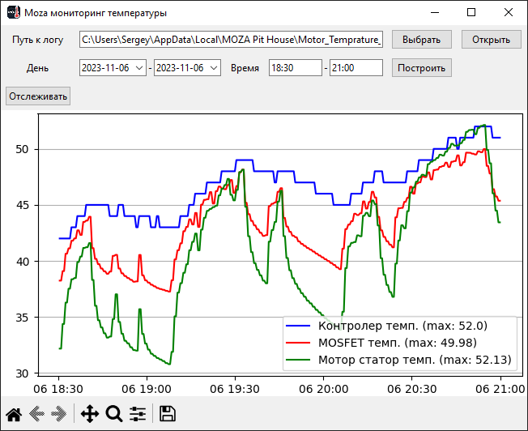

# Описание

Программа для просмотра логов температуры баз MOZA.

# Скачать

Скачать можно из вкладки [релизов](https://github.com/Rovlgut/moza_monitor_temp/releases)

# Запуск (установка)

Установка не требуется. Можно запускать из любого места.

# Руководство пользования

## Посмотреть историю

- После запуска надо открыть файл логов. Обычно он находяться по пусти "%LOCALAPPDATA%/MOZA Pit House/Motor_Temprature_Log.log". Этот путь сразу вставиться.
- Выбрать период времени отображения данных. Нажать "Построить".

## Отслеживать

- Так же открыть файл логов.
- Запустить Moza Pit House. (вроде как только когда он открыт, то он и записывает в файл, каждые 30с)
- Нажать кнопку "Отслеживать".
- Для остановки нажать "Остановить"

